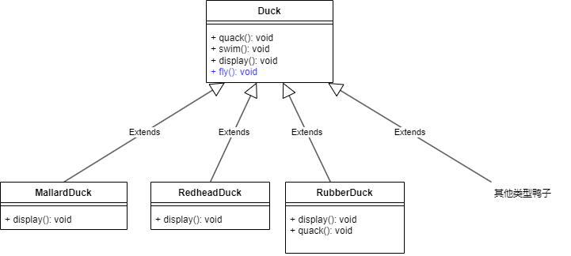

# 设计模式

## 模拟鸭子游戏（SimUDuck）案例

​	通过设想的需求来体验真实的开发场景，技术与业务结合学习掌握。

### 第一版

#### 需求

​	游戏中需要出现各种鸭子，一边游泳戏水，一边呱呱叫。

#### 设计

​	所有的鸭子都会游泳戏水和呱呱叫，所以想到的是写一个超类，超类里面实现游泳呱呱叫方法。display()是抽象的，每种鸭子外观不一样。


#### 代码实现

超类Duck

```java
public abstract class Duck {

    /**
     * 叫
     */
    public void quack(){
        System.out.println("呱呱叫");
    }

    /**
     * 游泳
     */
    public void swim(){
        System.out.println("会游泳");
    }

    /**
     * 外观
     */
    public abstract void display();

}
```

绿头鸭MallardDuck

```java
public class MallardDuck extends Duck{
    @Override
    public void display() {
        System.out.println("绿头");
    }
}
```

红头鸭RedheadDuck

```java
public class RedheadDuck extends Duck{
    @Override
    public void display() {
        System.out.println("红头");
    }
}
```

橡皮鸭RubberDuck

```java
public class RubberDuck extends Duck{
    /**
     * 因为橡皮鸭不是呱呱叫，所以重写quack方法
     */
    @Override
    public void quack () {
        System.out.println("吱吱叫");
    }

    @Override
    public void display () {
        System.out.println("橡皮鸭");
    }
}
```

测试类

```java
public class Main {
    public static void main(String[] args) {
        
        System.out.println("-----------绿头鸭-----------------");
        MallardDuck mallardDuck = new MallardDuck();
        mallardDuck.quack();
        mallardDuck.swim();
        mallardDuck.display();

        System.out.println("-----------红头鸭-----------------");
        RedheadDuck redheadDuck = new RedheadDuck();
        redheadDuck.quack();
        redheadDuck.swim();
        redheadDuck.display();
        
        System.out.println("-----------橡皮鸭-----------------");
        RubberDuck rubberDuck = new RubberDuck();
        rubberDuck.quack();
        rubberDuck.swim();
        rubberDuck.display();
    }
}


output:
-----------绿头鸭-----------------
呱呱叫
会游泳
绿头
-----------红头鸭-----------------
呱呱叫
会游泳
红头
-----------橡皮鸭-----------------
吱吱叫
会游泳
橡皮鸭
```


#### 优缺点

* 优点：quack swim实现在Duck超类中，凡是继承了该超类的鸭子都有这个能力，达到了方法复用。

* 缺点：在下个版本需求中体现。

### 第二版

#### 需求

​	让鸭子飞起来。

#### 设计

​	在超类Duck中增加飞(fly)的方法。



#### 代码实现

鸭子超类Duck

```java
public abstract class Duck {

    /**
     * 叫
     */
    public void quack(){
        System.out.println("呱呱叫");
    }

    /**
     * 游泳
     */
    public void swim(){
        System.out.println("会游泳");
    }

    /**
     * 外观
     */
    public abstract void display();

    /**
     * 飞
     */
    public void fly(){
        System.out.println("会飞");
    }

}

output
---------------------绿头鸭-----------------------------
呱呱叫
会游泳
我是绿头鸭
会飞
---------------------红头鸭-----------------------------
呱呱叫
会游泳
我是红头鸭
会飞
---------------------橡皮鸭-----------------------------
吱吱叫
会游泳
我是橡皮鸭
会飞
```

#### 优缺点

* 优点：同第一版的优点，代码复用。
* 缺点：完蛋了，橡皮鸭也会飞了。在超类中加上fly()就会导致所有的子类都具备fly()，连那些不该具备fly()的子类也无法免除。当前结构下怎么解决呢？橡皮鸭覆盖fly()什么也不做。如果再加入木头鸭呢(不会飞也不会叫)呢？又是一堆覆盖重写。缺点整理如下：
  * 很难知道所有鸭子的全部行为
  * 运行时的行为不容易改变
  * 改变会牵一发动全身，造成其他鸭子不想要的改变

### 改进

> 设计原则：
>
> ​	找出应用中心可能需要变化之处，把它们独立出来，不要和那些不需要变化的代码混在一起。
>
> ​	针对接口编程，而不是针对实现编程。

把容易变化的部分抽出来，例如fly()和quack()，定义在接口中，由不同的类去实现。


Duck类改造

```java
public abstract class Duck {
    FlyBehavior flyBehavior;
    QuackBehavior quackBehavior;
    /**
     * 游泳
     */
    public void swim(){
        System.out.println("会游泳");
    }

    /**
     * 外观
     */
    public abstract void display();

    public void performQuack(){
        quackBehavior.quack();
    }

    public void performFly(){
        flyBehavior.fly();
    }

    public void setFlyBehavior(FlyBehavior fb){
        flyBehavior = fb;
    }

    public void setQuackBehavior(QuackBehavior qb){
        quackBehavior = qb;
    }

}
```


## 观察者模式

